# Fullstack E-Commerce Frontend

React + Tailwind CSS frontend for a full-stack e-commerce application.  
Supports user authentication, product browsing, cart management, checkout, and admin features.

## 🌐 Live Demo
[Click here to view the live app](https://fullstack-ecommers-frontend.vercel.app/)

## 📸 Screenshots

### Home Page
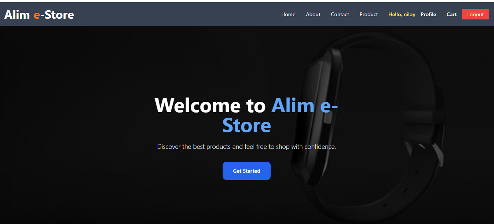

### Register / Login
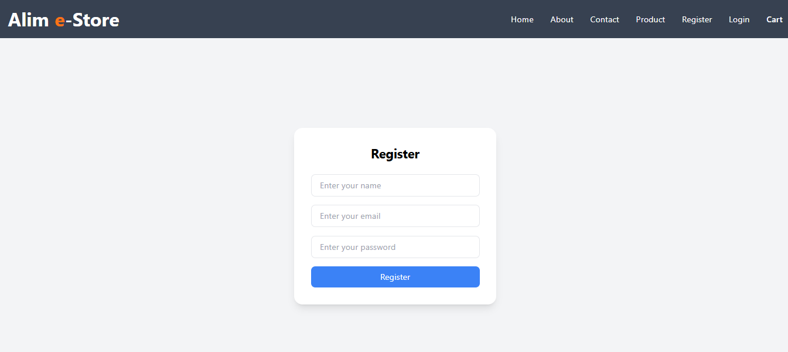
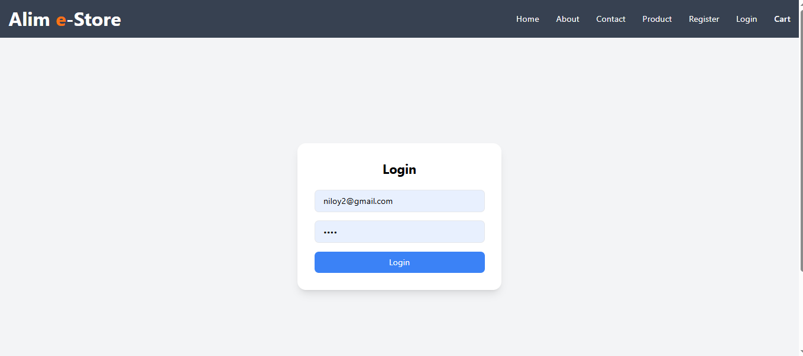

### Product Browsing & Filters
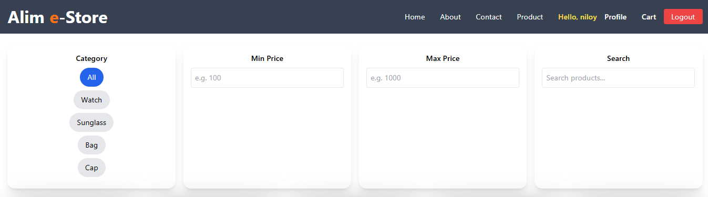

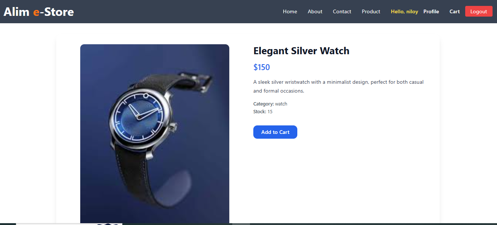

### Cart & Checkout
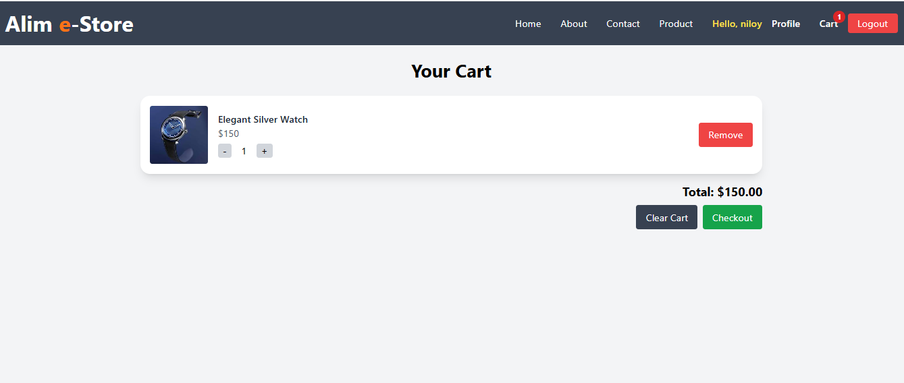
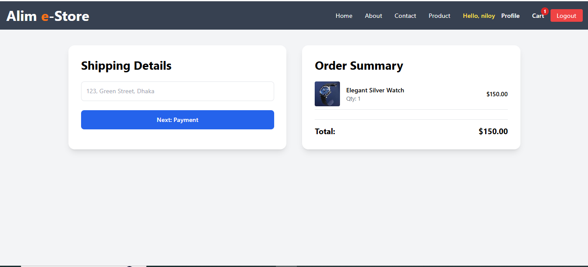
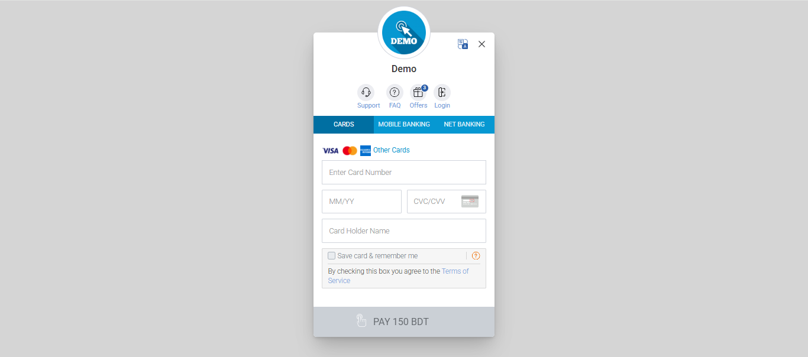

### Profile & Info Pages
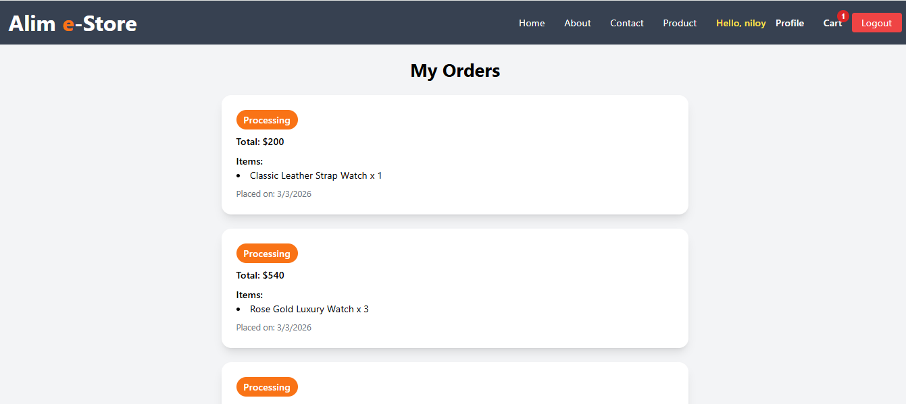
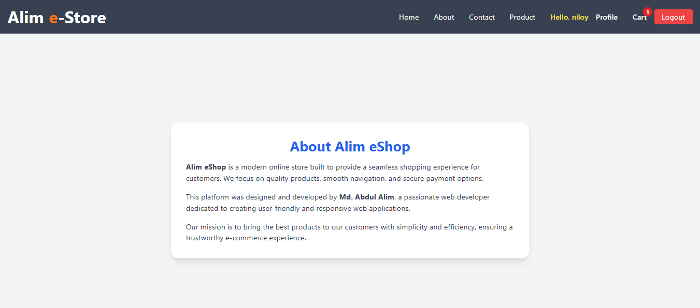
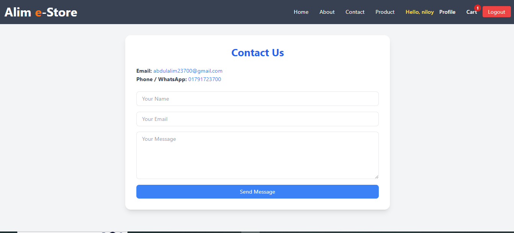

### Admin Panel
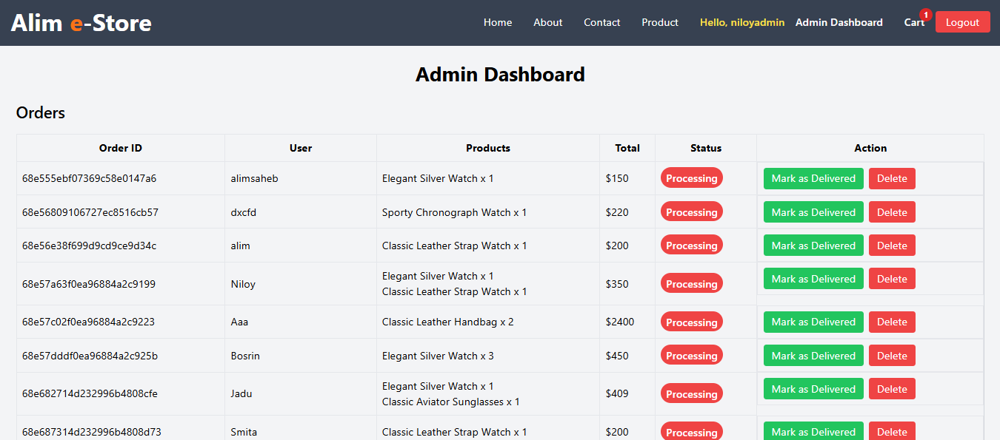
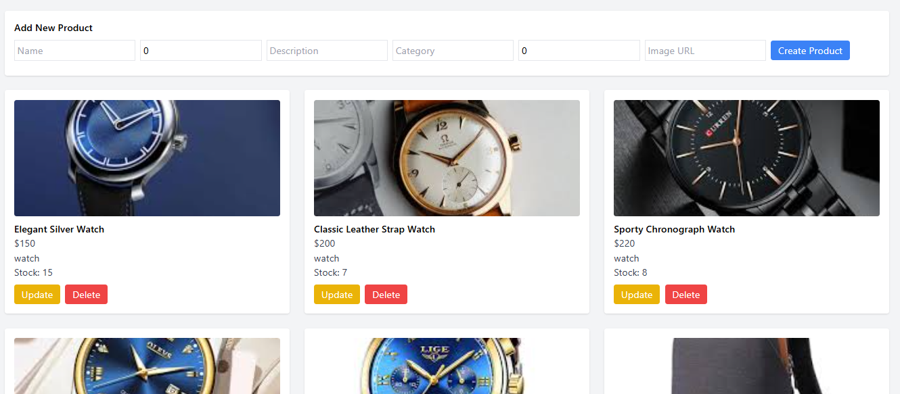

## 🛠 Tech Stack

- React.js
- Tailwind CSS & DaisyUI
- React Router DOM
- Axios for API calls
- LocalStorage for temporary state (cart & auth)

## ⚡ Backend API Base URL

Base URL: https://fullstackecommers-backend-uerv.onrender.com

✨ Features
Fully responsive design for desktop & mobile
User authentication (signup/login/logout)
Product browsing, filtering, and details
Shopping cart system with add/remove items
Checkout flow with payment gateway
Admin panel for product & order management
Profile, About, Contact pages

# 1. Clone the frontend repo
git clone https://github.com/ALIM23700/FullstackEcommers_Frontend.git

# 2. Navigate into the project folder
cd FullstackEcommers_Frontend

# 3. Install dependencies
npm install

# 4. Start the app locally
npm start

# 5. Open in browser at
http://localhost:3000/

📁 Project Structure
src/
app/ →Redux state management and Backend Url
components/ → Reusable UI components
pages/ → Home, Product, Cart, Profile, Admin pages
App.js → Main router & page rendering

🚀 Future Improvements
Integrate unit and integration tests
Improve performance & lazy load images
Enhance admin panel features
Add multilingual support

📄 License
You are free to use, modify, and distribute this project.
